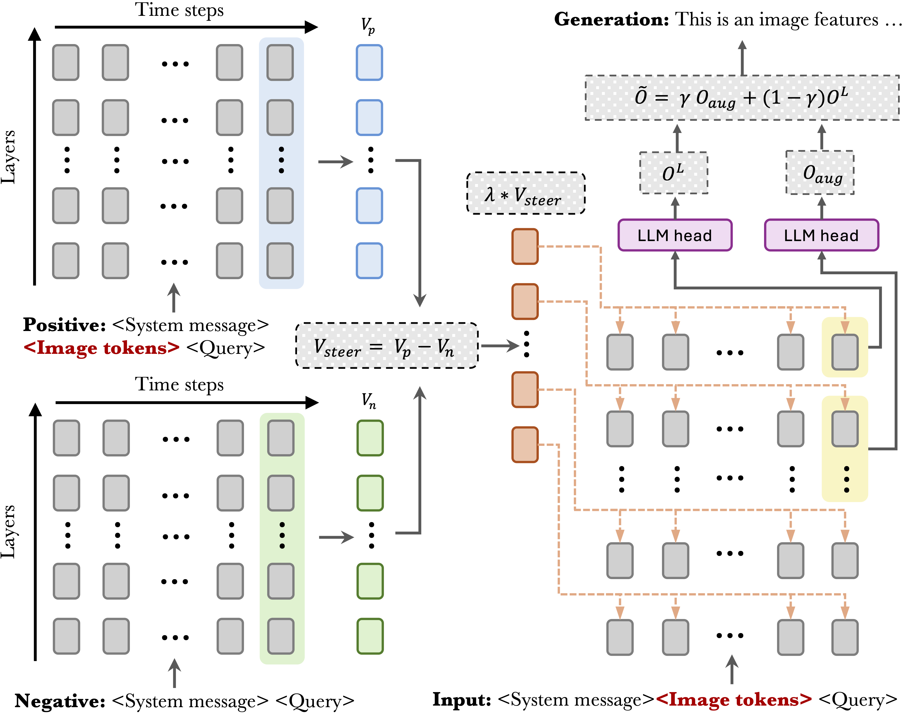

# VISTA: Visual Information Steering with Token-logit Augmentation

[](https://arxiv.org/pdf/2502.03628)

This is the official implementation of the paper "The Hidden Life of Tokens: Reducing Hallucination of Large Vision-Language Models via Visual Information Steering".



## Overview

VISTA is a training-free inference-time intervention framework that reduces hallucination in Large Vision-Language Models (LVLMs) while promoting genuine information. Our approach reveals and addresses three key patterns in how LVLMs process information:

1. **Gradual Visual Information Loss**: Visually grounded tokens gradually become less favored throughout generation
2. **Early Excitation**: Semantically meaningful tokens achieve peak activation in layers earlier than the final layer
3. **Hidden Genuine Information**: Visually grounded tokens maintain relatively high rankings at inference

VISTA combines two complementary approaches:
- **Visual Steering Vector (VSV)**: Reinforces visual information in activation space
- **Self-Logits Augmentation (SLA)**: Leverages early layer activations to promote semantically meaningful decoding

## Key Features

- Training-free inference-time intervention
- No external supervision required
- Compatible with various decoding strategies
- Applicable across multiple LVLM architectures
- Reduces hallucination by ~40% on evaluated open-ended tasks

## Installation

```bash
# Git LFS is required for the bundled MMHal-Bench assets.
git lfs install

# Clone this V100-configured repository.
git clone https://github.com/alpha-godzilla/vista-v100.git
cd vista-v100
git lfs pull

# Create and activate the virtual environment
conda env create -f environment.yml
```

For the V100 server, install the CUDA 11.8 PyTorch build before the
remaining Python dependencies:

```bash
pip install torch==2.0.1 torchvision==0.15.2 torchaudio==2.0.2 \
  --index-url https://download.pytorch.org/whl/cu118
pip install -r requirements.txt
```

## Prepare Data
Download MSCOCO 2014 dataset from [the official website](https://cocodataset.org/#home) and extract it to your data directory.

### V100 server paths

This fork defaults to the following server layout:

```text
/home/sun_yuxi/luo_jiacheng/VISTA
/data/sun_yuxi/models/llava-1.5-7b-hf
/data/sun_yuxi/datasets/coco/{train2014,val2014,annotations}
```

The defaults can be changed without editing the code:

```bash
export VISTA_LLAVA_MODEL_PATH=/path/to/llava-1.5-7b-hf
export VISTA_COCO_ROOT=/path/to/coco
```


## Usage

```bash
# For CHAIR evaluation.
bash run_chair.sh

# Sweep CHAIR gamma/lambda settings on six GPUs and summarize the metrics.
bash run_chair_sweep.sh

# Run the optional OT-BarySLA extension.
bash run_chair_ot_bary.sh

# Refine OT top-k and visual-token counts around the current best point.
bash run_chair_ot_topk_visual_sweep.sh

# Sweep larger OT visual grids (100/196/324/576) and top-k (8/16/32/64).
bash run_chair_ot_large_visual_sweep.sh

# For POPE evaluation (specify split with --pope-type).
bash run_pope.sh

# For mmhal evaluation.
bash run_mmhal.sh
```

Please check the corresponding bash script for how to read results.

### OT-BarySLA

This copy includes an optional, training-free OT-BarySLA implementation for
LLaVA-1.5. It dynamically weights VISTA's selected early-layer logits using a
small OMIT-style optimal-transport problem over projected visual tokens and
top-ranked token embeddings. The original VISTA path remains the default and
is unchanged when `--use-ot-bary-sla` is absent.

See [OT_BARY_SLA.md](OT_BARY_SLA.md) for the method, commands, tests, and
benchmark procedure.

### Attention-OT CHAIR results

The unpooled attention-OT variant keeps VISTA's `vsv_lambda=0.17`,
`logits_alpha=0.3`, and `logits_layers=25,30`.  It replaces only SLA's
uniform average over the selected early-layer logits with OT-derived,
image-conditioned layer weights.  The table reports matched five-seed CHAIR
evaluation (`seeds={1994,2024,3407,42,1234}`; 500 captions per seed), with
`uniform_mix=0.02`. Deltas are paired OT minus VISTA values for the same seed;
the value after `+/-` is the across-seed standard deviation of that delta.

| Method / attention-OT setting | CHAIRs ↓ | Δ CHAIRs | CHAIRi ↓ | Δ CHAIRi | Recall ↑ | Precision ↑ | F1 ↑ | Δ F1 | Len |
|---|---:|---:|---:|---:|---:|---:|---:|---:|---:|
| VISTA baseline | 0.1676 | — | 0.0674 | — | 0.5711 | 0.8917 | 0.6963 | — | 1.6370 |
| OT: layer temp. `0.06`, attention power `0.75` **(hallucination priority)** | **0.1436** | **-0.0240 +/- 0.0105** | **0.0525** | **-0.0149 +/- 0.0057** | 0.5370 | **0.9017** | 0.6731 | -0.0232 +/- 0.0077 | 2.0638 |
| OT: layer temp. `0.06`, attention power `1.0` | 0.1464 | -0.0212 +/- 0.0155 | 0.0547 | -0.0126 +/- 0.0046 | 0.5404 | 0.8986 | 0.6748 | -0.0215 +/- 0.0089 | 2.0006 |
| OT: layer temp. `0.10`, attention power `0.75` | 0.1496 | -0.0180 +/- 0.0127 | 0.0610 | -0.0064 +/- 0.0049 | 0.5463 | 0.8985 | 0.6795 | -0.0168 +/- 0.0093 | 1.8863 |
| OT: layer temp. `0.10`, attention power `1.0` **(F1-balanced)** | 0.1516 | -0.0160 +/- 0.0091 | 0.0608 | -0.0066 +/- 0.0085 | **0.5486** | 0.8978 | **0.6811** | **-0.0152 +/- 0.0068** | **1.8729** |

All four settings reduce CHAIRs relative to VISTA. The `0.06/0.75` setting is
the preferred choice when hallucination reduction is the primary objective;
`0.10/1.0` gives the smallest F1 decrease among the evaluated attention-OT
configurations. Run the corresponding refinement with:

```bash
bash run_chair_ot_attention_multiseed_refine.sh
```

To tune VISTA's original `logits_alpha` fairly for both original VISTA and
attention-OT, run the paired five-seed alpha search. It fixes attention-OT at
layer temperature `0.06`, attention power `0.75`, uniform mix `0.02`, top-k
`16`, and epsilon `0.05` while searching alpha values `0.15–0.35` for both
methods:

```bash
bash run_chair_ot_attention_alpha_multiseed.sh
```

For a single-image diagnosis of whether attention-OT under-attends to selected
COCO object boxes, run:

```bash
bash run_chair_ot_attention_trace.sh COCO_IMAGE_ID
```

It writes an object-level attention-coverage report beside the single-image
result. See [OT_BARY_SLA.md](OT_BARY_SLA.md) for the interpretation.

For a three-seed, eight-GPU ablation of coverage-aware visual marginals and
adaptive alpha against the same original-VISTA baseline, run:

```bash
bash run_chair_ot_attention_module_ablation.sh
```

For the five-seed adaptive-alpha fine search, including matched fixed-alpha
VISTA/attention-OT controls, run:

```bash
bash run_chair_ot_adaptive_alpha_refine.sh
```

The CHAIR sweep defaults to gamma values `0.1 0.2 0.3 0.4`, lambda
values `0.13 0.14 0.15 0.16 0.17 0.18`, and GPUs `0 1 2 3 4 5`.
Here gamma refers to VISTA's `--logits-alpha`. The 24 runs are distributed
round-robin across the six GPUs. Completed 500-caption JSONL files are reused,
partial files are preserved with a timestamp, and the final CHAIR metrics are
written to:

```text
exp_results/chair_sweep_gamma_lambda/chair_sweep_summary.md
exp_results/chair_sweep_gamma_lambda/chair_sweep_summary.csv
```

The defaults can be overridden with environment variables:

```bash
GPU_IDS="0 1 2 3 4 5" SUBSET_SIZE=500 bash run_chair_sweep.sh
```

### Configuration Options

1. **Model Selection**: Use "--model" to specify the target LVLM (supported: "llava-1.5", "instructblip", "shikra", "minigpt-4")

2. **Visual Steering Vector (VSV )**: Enable with "--vsv" and control strength via "--vsv-lambda"

3. **Self-Logits Augmentation (SLA)**: Enable with "--logits-aug", configure target layers with "--logits-layers" and mixing ratio with "--logits-alpha"


## Best Practices

1. VSV is designed to counteract Gradual Visual Information Loss and is suitable for open-ended generation tasks. Different LVLMs favor different lambda scales, so users should calibrate the scale when using new architectures. The --vsv-lambda parameter provides a flexible way to adjust the model from being more aggressive (more hallucination) to more conservative.
3. The impact of SLA depends on both target layers and the strength of --logits-alpha. A rule of thumb is to use a smaller alpha for larger window sizes and vice versa (see Table 4 in the paper).


## Citation
```bibtex
@misc{li2025hiddenlifetokensreducing,
      title={The Hidden Life of Tokens: Reducing Hallucination of Large Vision-Language Models via Visual Information Steering}, 
      author={Zhuowei Li and Haizhou Shi and Yunhe Gao and Di Liu and Zhenting Wang and Yuxiao Chen and Ting Liu and Long Zhao and Hao Wang and Dimitris N. Metaxas},
      year={2025},
      eprint={2502.03628},
      archivePrefix={arXiv},
      primaryClass={cs.CV},
      url={https://arxiv.org/abs/2502.03628}, 
}
```

## Acknowledgement
This project builds upon the following excellent works:
- [PAI](https://github.com/LALBJ/PAI)
- [ICV](https://github.com/shengliu66/ICV)
- [OPERA](https://github.com/shikiw/OPERA)
